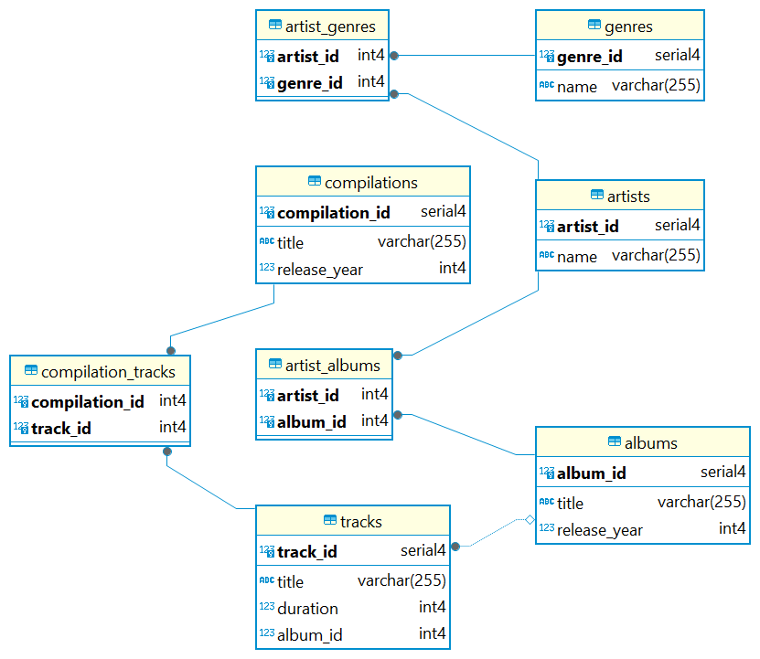

# Музыкальный сервис - Схема базы данных

## Описание задания

Необходимо развивать схему для музыкального сервиса.

Ранее существовало ограничение, что каждый исполнитель поёт строго в одном жанре, пора его убрать. Исполнители могут петь в разных жанрах, как и одному жанру могут принадлежать несколько исполнителей.

Аналогичное ограничение было и с альбомами у исполнителей — альбом мог выпустить только один исполнитель. Теперь альбом могут выпустить несколько исполнителей вместе. Как и исполнитель может принимать участие во множестве альбомов.

С треками ничего не меняем, всё так же трек принадлежит строго одному альбому.

Но появилась новая сущность — сборник. Сборник имеет название и год выпуска. В него входят различные треки из разных альбомов.

Обратите внимание: один и тот же трек может присутствовать в разных сборниках.

## Созданные таблицы

1. **Таблица `genres`**:
    - **Описание**: Таблица жанров.
    - **Структура**:
      - `genre_id SERIAL PRIMARY KEY`: Идентификатор жанра.
      - `name VARCHAR(255) NOT NULL`: Название жанра.

2. **Таблица `artists`**:
    - **Описание**: Таблица исполнителей.
    - **Структура**:
      - `artist_id SERIAL PRIMARY KEY`: Идентификатор исполнителя.
      - `name VARCHAR(255) NOT NULL`: Имя исполнителя.

3. **Таблица `albums`**:
    - **Описание**: Таблица альбомов.
    - **Структура**:
      - `album_id SERIAL PRIMARY KEY`: Идентификатор альбома.
      - `title VARCHAR(255) NOT NULL`: Название альбома.
      - `release_year INT CHECK (release_year >= 1900)`: Год выпуска альбома с ограничением (не менее 1900 года).

4. **Таблица `tracks`**:
    - **Описание**: Таблица треков.
    - **Структура**:
      - `track_id SERIAL PRIMARY KEY`: Идентификатор трека.
      - `title VARCHAR(255) NOT NULL`: Название трека.
      - `duration INT CHECK (duration > 0)`: Продолжительность трека с ограничением (должна быть больше 0).
      - `album_id INT REFERENCES albums(album_id)`: Внешний ключ на идентификатор альбома.

5. **Таблица `compilations`**:
    - **Описание**: Таблица сборников.
    - **Структура**:
      - `compilation_id SERIAL PRIMARY KEY`: Идентификатор сборника.
      - `title VARCHAR(255) NOT NULL`: Название сборника.
      - `release_year INT CHECK (release_year >= 1900)`: Год выпуска сборника с ограничением (не менее 1900 года).

6. **Таблица `artist_genres`**:
    - **Описание**: Таблица связи многие-ко-многим между жанрами и исполнителями.
    - **Структура**:
      - `artist_id INT REFERENCES artists(artist_id)`: Внешний ключ на идентификатор исполнителя.
      - `genre_id INT REFERENCES genres(genre_id)`: Внешний ключ на идентификатор жанра.
      - `PRIMARY KEY (artist_id, genre_id)`: Композитный первичный ключ.

7. **Таблица `artist_albums`**:
    - **Описание**: Таблица связи многие-ко-многим между исполнителями и альбомами.
    - **Структура**:
      - `artist_id INT REFERENCES artists(artist_id)`: Внешний ключ на идентификатор исполнителя.
      - `album_id INT REFERENCES albums(album_id)`: Внешний ключ на идентификатор альбома.
      - `PRIMARY KEY (artist_id, album_id)`: Композитный первичный ключ.

8. **Таблица `compilation_tracks`**:
    - **Описание**: Таблица связи многие-ко-многим между треками и сборниками.
    - **Структура**:
      - `compilation_id INT REFERENCES compilations(compilation_id)`: Внешний ключ на идентификатор сборника.
      - `track_id INT REFERENCES tracks(track_id)`: Внешний ключ на идентификатор трека.
      - `PRIMARY KEY (compilation_id, track_id)`: Композитный первичный ключ.

## SQL-запросы

SQL-код для создания таблиц можно найти в файле [sql_code.sql](./sql_code.sql).

## Схема базы данных

Схему базы данных можно увидеть на следующем изображении:

